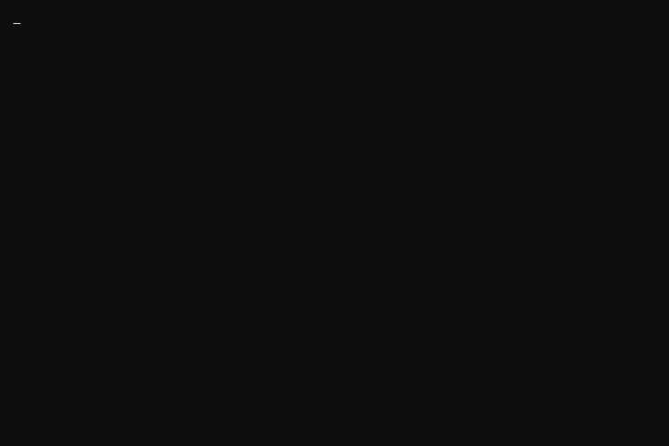

<picture>
    
</picture>

<i>Generated automatically using [x0rzavi/github-readme-terminal](https://github.com/x0rzavi/github-readme-terminal)</i>

<!---
Wira07/Wira07 is a ✨ special ✨ repository because its `README.md` (this file) appears on your GitHub profile.
You can click the Preview link to take a look at your changes.
--->
